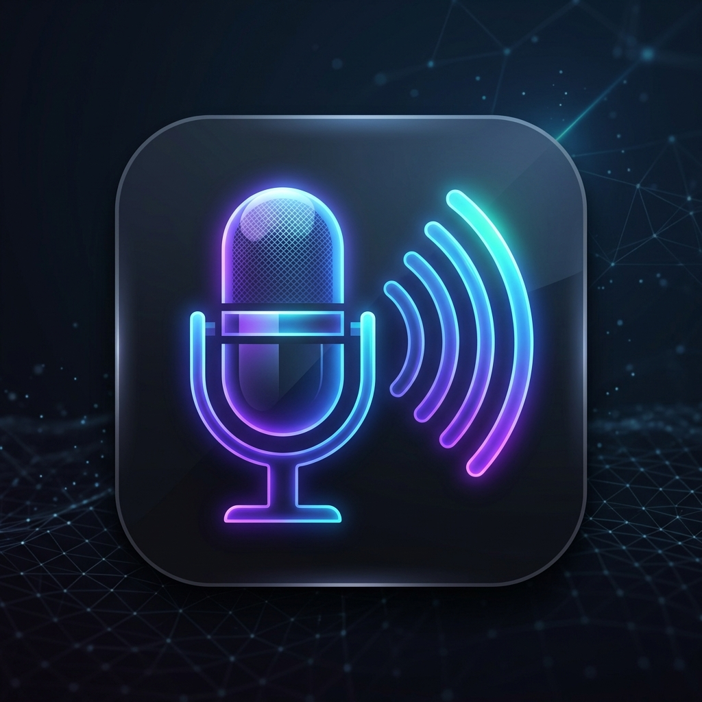

# Virtual Mic Android

> [!IMPORTANT]
> **AI-Powered Development**: This entire project—including the Android application, the PC receiver server, and even this documentation—was researched, designed, and implemented using **Artificial Intelligence**.

**Virtual Mic** is a high-performance Android application designed to stream your device's audio (Microphone, System Media, or Both) directly to your PC over Wi-Fi with minimal latency.

## 🚀 Features

- **Triple Streaming Modes**:
  - 🎤 **Mic Only**: Use your phone as a high-quality wireless microphone for your PC.
  - 🎵 **Media Only**: Stream system audio (YouTube, Music, Games) directly to your PC.
  - 🔄 **Both**: Stream both your voice and system audio simultaneously.
- **Low Latency**: Optimized UDP-based streaming with `WIFI_MODE_FULL_LOW_LATENCY` support.
- **Audio Settings**: Fully customizable sample rates (16kHz, 44.1kHz, 48kHz), Mono/Stereo toggle, and adjustable Mic Gain (0.1x to 5.0x) directly from the app.
- **Background Reliable**: Uses Foreground Services and WakeLocks to ensure streaming doesn't cut out when the screen is off.
- **Modern UI**: Built with Jetpack Compose, featuring Material 3 design and Dark Mode support.
- **Battery Optimization Aware**: Built-in prompts to help you exclude the app from battery restrictions for stable long-term streaming.

## 📦 Installation & Setup

### 1. PC Receiver (Server)
You must have the receiver app running on your Windows PC to hear the audio.
- Download the server source code from this repository.
- Ensure you have Python installed, then install dependencies: `pip install pyaudio numpy customtkinter pystray pillow zeroconf`
- Run the server: `python server.py`
- It will listen on **UDP Port 8765**. Ensure your Windows Firewall allows this traffic.

### 2. Android App (Client)
- Download the latest **`.apk`** from the [Releases](https://github.com/Ariok12/VirtualMic/releases) page.
- Install it on your Android device (ensure "Install from unknown sources" is enabled).

## 🛠️ How To Use

1. **Connectivity**: Ensure your Phone and PC are on the same Wi-Fi network.
2. **🔍 Auto-Detect PC (Network Service Discovery)**:
   - The PC Server now broadcasts its IP address on your local Wi-Fi.
   - In the Android app, simply tap the **Search (Magnifying Glass)** Icon next to the IP address input.
   - The app will automatically find the PC and fill in the IP Address!
3. **Manual Setup (Fallback)**:
   - If auto-detect fails, open the PC server to see your local IP (e.g., `192.168.1.5`).
   - Enter that IP address manually in the Android app.
4. **Stream**: Select your mode (Mic, Media, or Both) and click Start!
   - Grant necessary permissions (Audio, Notifications, Media Projection) when prompted.

## 📡 Technical Details

- **Protocol**: UDP (User Datagram Protocol)
- **Port**: 8765
- **Audio Format**: Raw PCM 16-bit
- **Sample Rate**: 16kHz / 44.1kHz / 48kHz (Selectable in settings)
- **Channels**: Mono / Stereo (Selectable in settings)
- **Minimum SDK**: Android 10 (API 29) - Required for System Audio Capture.

## 📸 Permissions Required

- `RECORD_AUDIO`: To capture microphone input.
- `FOREGROUND_SERVICE`: To maintain the connection in the background.
- `MEDIA_PROJECTION`: Required for capturing system/media audio.
- `POST_NOTIFICATIONS`: To show the persistent control notification.

## 🤝 Contributing

Feel free to fork this project and submit pull requests. For major changes, please open an issue first to discuss what you would like to change.

---

*Developed by Ariok12*
